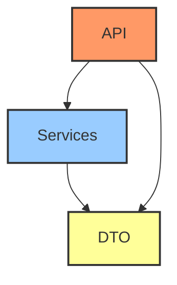

# FastAPI Naive

A "naive" FastAPI application template demonstrating a clean API and service layer structure without database integration.

## Architecture

The application follows a simplified two-layer pattern:

### Layer Description

- **API Layer**: Handles HTTP requests and responses.
- **Services Layer**: Contains the application's business logic, working with in-memory data.
- **DTO Layer**: Defines Pydantic models for data transfer between layers.

## Setup Instructions

- Create a virtual environment: `python -m venv .venv`
- Activate the environment.
- Install dependencies: `uv sync` (or `pip install -r requirements.txt` if you generate one).
- Run the application: `uvicorn src.main:app --reload`
