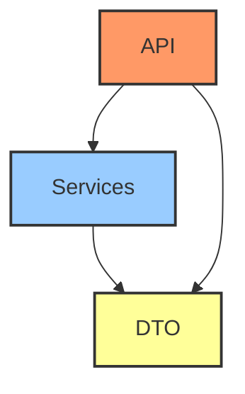

# Архитектурные Слои Приложения

Приложение следует упрощенной слоистой архитектуре для четкого разделения ответственностей.

## Диаграмма Архитектуры

## Описание Слоев

-   **API Layer (Слой API)**:
    -   Отвечает за обработку входящих HTTP-запросов и формирование HTTP-ответов.
    -   Преобразует HTTP-запросы в вызовы сервисного слоя, используя DTO для передачи данных.
    -   Валидирует входящие данные с помощью FastAPI и Pydantic DTO.
    -   Расположение: `src/app/api/`

-   **Services Layer (Сервисный Слой)**:
    -   Содержит основную бизнес-логику приложения.
    -   В данном шаблоне работает с данными, хранящимися в памяти (in-memory), для демонстрации.
    -   Не зависит от деталей HTTP, а работает с DTO и бизнес-объектами.
    -   Расположение: `src/app/services/`

-   **DTO (Data Transfer Objects) Layer (Слой Объектов Передачи Данных)**:
    -   Определяет модели Pydantic, используемые для передачи структурированных данных между слоями.
    -   Обеспечивают валидацию данных, сериализацию и десериализацию.
    -   Расположение: `src/app/dto/`
